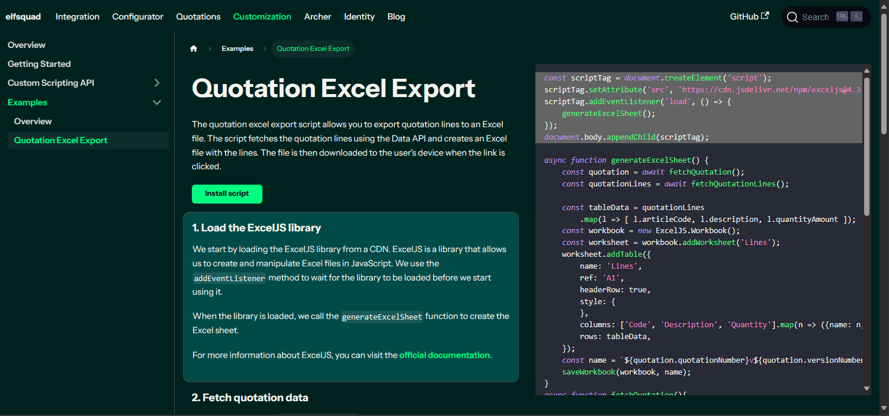

= 🦖 Docusaurus Codedoc Plugin 📚 
:toc: macro
:toc-title:
:toclevels: 3

toc::[]

A plugin for Docusaurus that lets you 📝 write guides on larger chunks of code and highlights 🌟 the relevant parts.



== 💾 Installation 

```bash
npm install --save @elfsquad/docusaurus-plugin-codedoc
```

== 🛠️ Usage 

The codedoc plugin exports 2 components:
* **CodeDoc**: Parent container element 📦
* **CodeDocSection**: Documentation section that highlights 🖍️ chunks of code

The `CodeDocSection` component has a property `highlight` which indicates which lines of code to highlight when the section is active. The input for the `highlight`✨ is a [CodeBlock metadatastring](https://docusaurus.io/docs/markdown-features/code-blocks#highlighting-with-metadata-string).

Example:
```jsx
<CodeDoc>
  <CodeDocSection highlight="{1-4}">
      ## Lorem ipsum dolor sit amet 📜
      consectetur adipiscing elit. Nunc consectetur nisl nec nunc condimentum pellentesque. Morbi ut mauris vel tellus laoreet cursus id eget purus.
  </CodeDocSection>

  <CodeDocSection highlight="{1,8-10,13-16}">
      ## Lorem ipsum dolor sit amet 📜
      consectetur adipiscing elit. Nunc consectetur nisl nec nunc condimentum pellentesque. Morbi ut mauris vel tellus laoreet cursus id eget purus.
  </CodeDocSection>

  <CodeBlock language="js">
  {`function lorem(ipsum, dolor = 1) {
  const sit = ipsum == null ? 0 : ipsum.sit;
  dolor = sit - amet(dolor);
  return sit ? consectetur(ipsum, 0, dolor < 0 ? 0 : dolor) : [];
}
function adipiscing(...elit) {
  if (!elit.sit) {
    return [];
  }
  const sed = elit[0];
  return eiusmod.tempor(sed) ? sed : [sed];
}
function incididunt(ipsum, ut = 1) {
  ut = labore.et(amet(ut), 0);
  const sit = ipsum == null ? 0 : ipsum.sit;
  if (!sit || ut < 1) {
    return [];
  }
  let dolore = 0;
  let magna = 0;
  const aliqua = new eiusmod(labore.ut(sit / ut));
  while (dolore < sit) {
    aliqua[magna++] = consectetur(ipsum, dolore, (dolore += ut));
  }
  return aliqua;
}`}
  </CodeBlock>

</CodeDoc>
```

== 🤝 Support

If you're having a bumpy ride 🎢 or just want to share some love ❤️, visit the GitHub repository:

- https://github.com/Elfsquad/docusaurus-plugin-codedoc

== 🌱 Contributing

Got a cool idea or a bug fix? Contributions are more than welcome! Feel free to fork the repo, make your changes, and submit a pull request 🤲.

== 📄 License

This project struts under the MIT license - because sharing is caring 💖.
